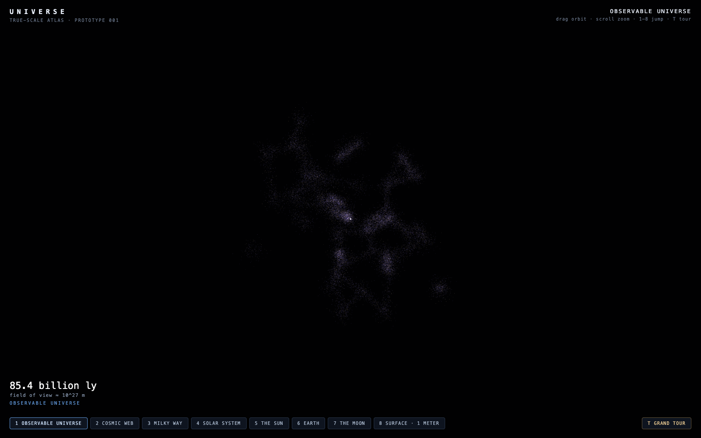
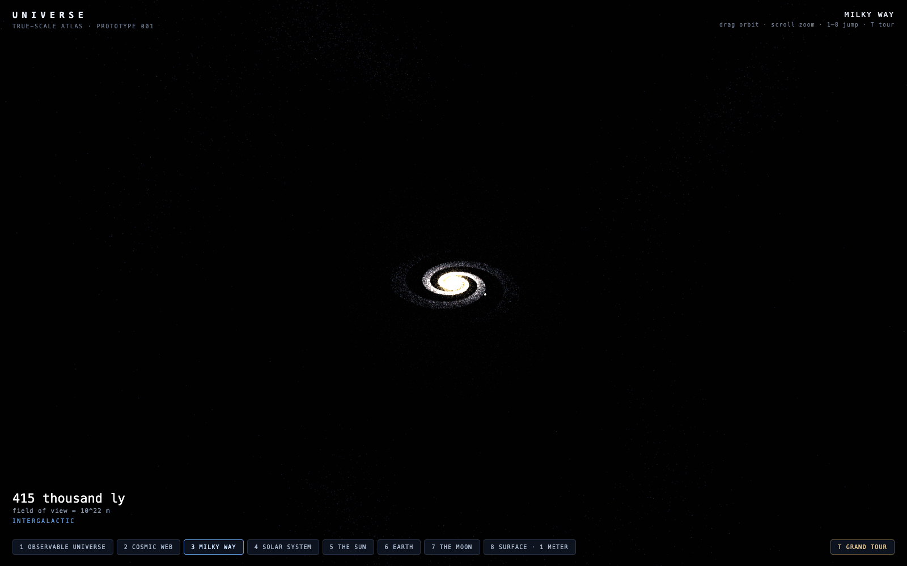
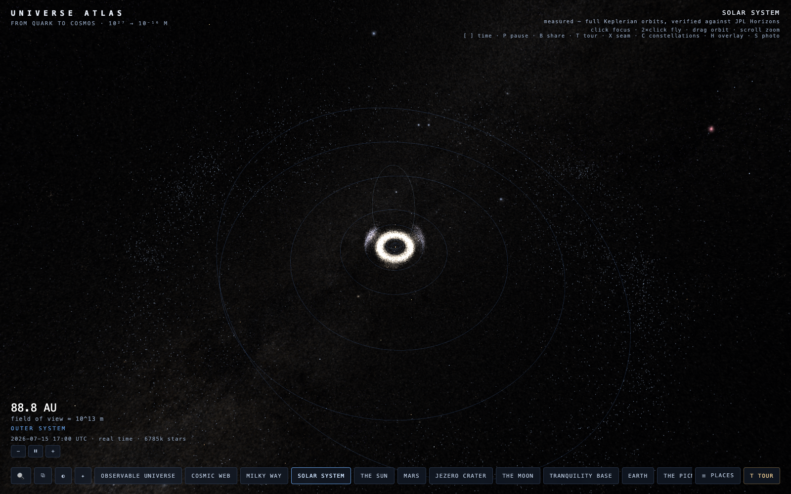
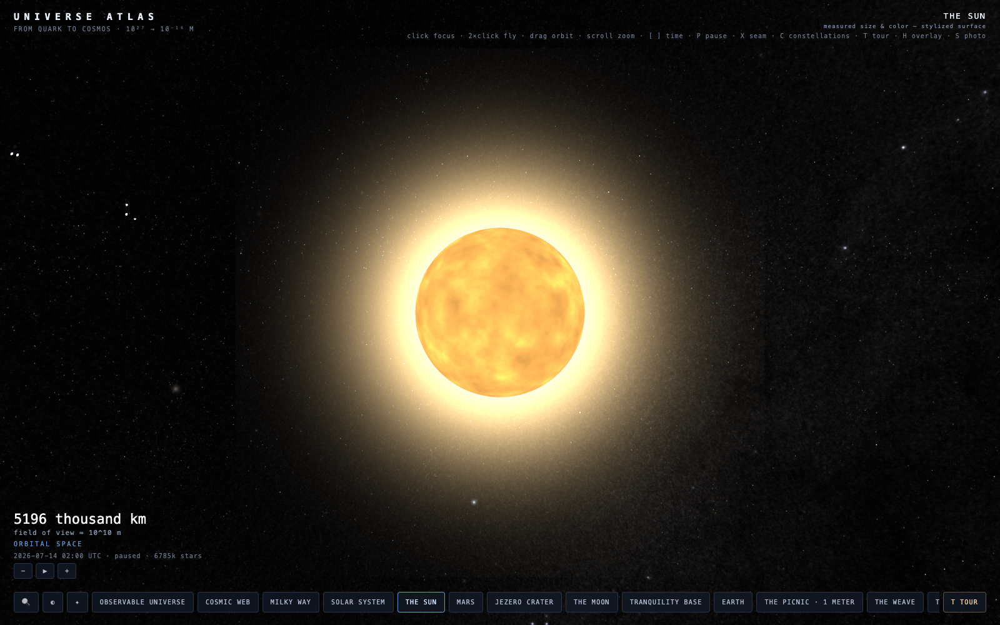
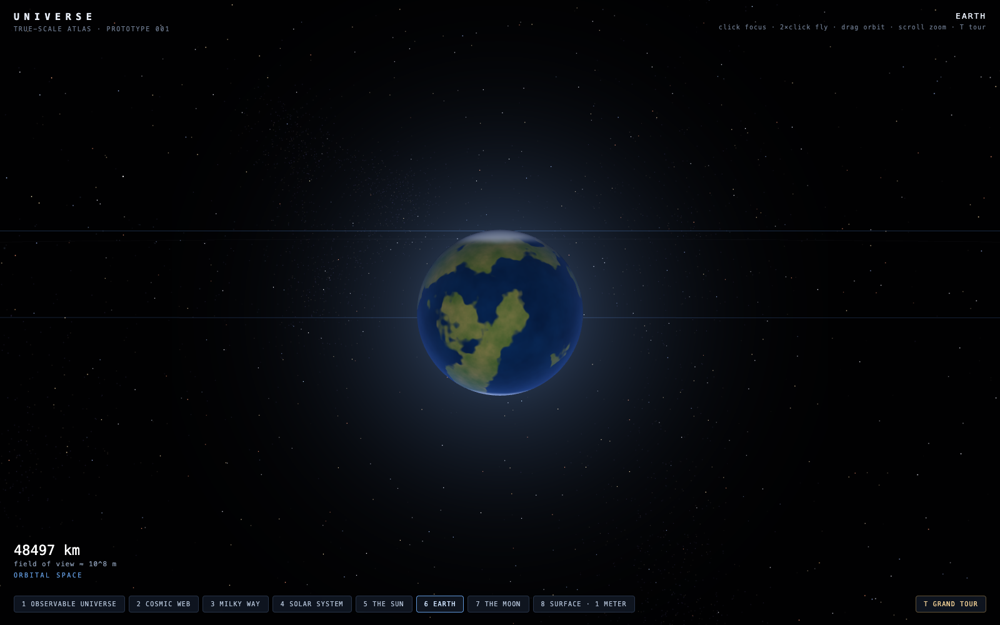
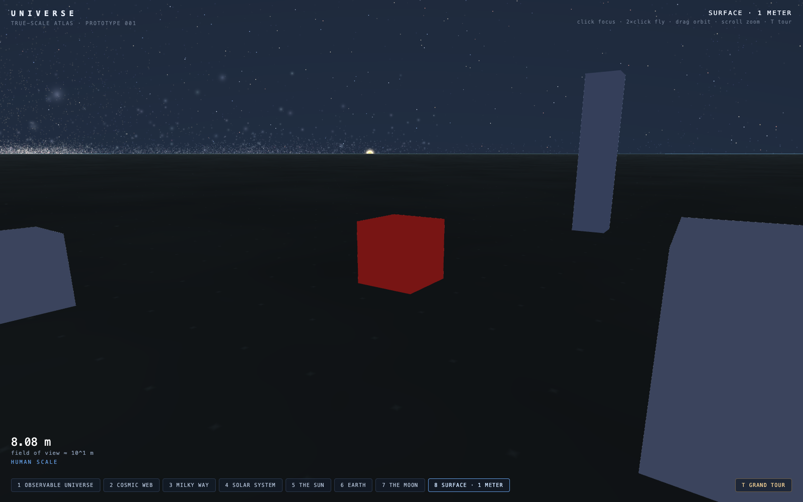
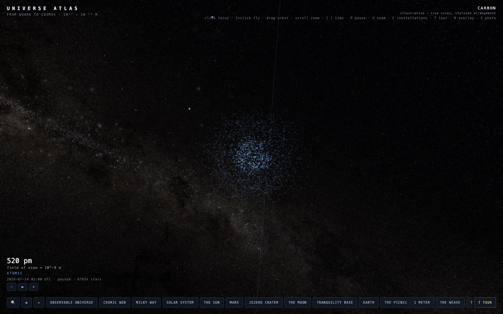
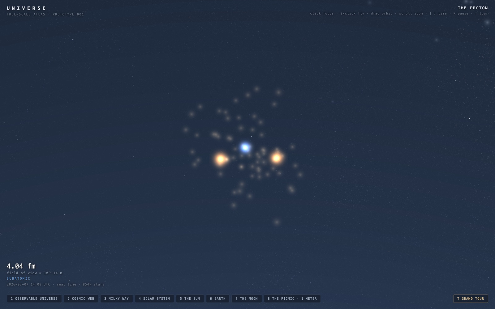

# Universe Atlas

**The universe in your browser, to true scale** — one continuous scroll across
**43 orders of magnitude**, from quark to cosmos: the observable universe
(~10²⁷ m) down through a picnic blanket on the Chicago lakefront and into a
proton (10⁻¹⁶ m). Pure WebGPU, zero runtime dependencies, ~25 KB gzipped.

[](https://github.com/chrisjz/universe/actions/workflows/ci.yml)
[](LICENSE)

https://github.com/user-attachments/assets/db0eea40-6617-40e0-815d-882b9786ad90


_The grand tour, 43 orders of magnitude in one continuous flight — press **T** in
the [live atlas](https://universeatlas.org/?tour=1) to fly it yourself._

## The zoom

Forty-three orders of magnitude, and every step of it is the same scene — no level
loads, no cuts. Scroll in and the engine hands focus down the chain automatically
(universe → galaxy → solar system → Earth → the picnic → the weave → a cotton
fiber → a cellulose molecule → a carbon atom → its nucleus → a proton); scroll
out and it hands it back. Or press **T** and let the grand tour fly you the way.
The inward half is _Powers of Ten_'s second act: sizes are true, arrangements
are illustrative — below the atom, nature stops posing for portraits.

|                                                                                   |                                                                                 |
| :-------------------------------------------------------------------------------: | :-----------------------------------------------------------------------------: |
|  **10²⁷ m** · the cosmic web |       **10²² m** · the Milky Way       |
|     **10¹³ m** · the solar system     |             **10¹⁰ m** · the Sun            |
|               **10⁸ m** · Earth               |  **10¹ m** · the picnic, exactly 1 m |
|       **10⁻¹⁰ m** · a carbon atom      |   **10⁻¹⁴ m** · three quarks   |

Earth is the real Earth — NASA Blue Marble by day, Black Marble city lights on
the night side — and the bottom of the zoom is an homage: a one-meter
red-checkered **picnic blanket on the Chicago lakefront** (41.869°N, 87.618°W),
where the Eames' _Powers of Ten_ opened in 1977. Structure is real wherever a
catalog reaches: 854,000 ATHYG stars, and — out to ~260 Mpc — the **real local
universe**, 43,000 galaxies of the 2MASS Redshift Survey with Virgo, Coma, and
the Great Wall at their measured places (the empty band along the Milky Way's
plane is the survey's genuine zone of avoidance — dust, not absence). Only
beyond the surveys' reach does procedural placeholder (deterministic seed)
take over, and every dimension that can be real already is: actual planetary
radii and semi-major axes, the real Moon distance, the real
Sun–galactic-center distance, a Milky Way with the real ~2.6 kpc disk scale
length. Time is real too: the
planets and the Moon sit at their true positions for the simulated date (a
mean-longitude ephemeris — circular, coplanar approximation) and move as the
clock runs, from real time up to a billion years per second — and the Earth
turns at the sidereal rate, phase-locked so the sub-solar longitude matches
UTC: the picnic sees sunrise when Chicago does, seasons included — a 71.6°
summer solstice sun, 24.7° in December, fifteen-hour June days — and at one
hour per second you can watch the sun set from the blanket. Push past ten
years per second and the clock goes cosmic: Earth's axis precesses its
25,772-year cone (scrub ahead 12,000 years and **Vega** is the pole star;
rewind 4,800 and it's Thuban, just as the pyramid builders had it), the sun
runs its 225-million-year lap around the galactic center, and the cosmic
web — drawn in comoving coordinates — expands with the real ΛCDM scale
factor: rewind toward the Big Bang and everything draws close together;
run it forward 50 billion years and the filaments disperse into the dark.
[`?years=-13e9`](https://universeatlas.org/?goto=universe&years=-13e9)
is a shareable link to just after the beginning. The roadmap swaps the
placeholders for real catalogs — Gaia DR3 stars, SDSS galaxies — without
touching the engine.

## Try it

```
npm install
npm run dev
```

Open the printed URL in a WebGPU browser (Chrome, Edge, or Safari 18+).

| Input       | Action                                                                                                                |
| ----------- | --------------------------------------------------------------------------------------------------------------------- |
| **scroll**  | seamless zoom — all the way down, all the way back up                                                                 |
| **click**   | focus what's under the cursor (planet, moon, any named star) — camera stays put, scrolling now converges there        |
| **2×click** | fly to what's under the cursor                                                                                        |
| **drag**    | orbit the current focus — on the ground the drag keeps going past the horizon, tilting your gaze up to the night sky  |
| **⇧-drag**  | (or right-drag) grab the ground and roam anywhere on Earth — imagery and terrain follow                               |
| **1–9, 0**  | fly to a bookmark (universe, web, galaxy, system, sun, earth, moon, tranquility base, picnic, weave)                  |
| **/**       | search everything — all 195 named stars, planets, and every stage of the dive                                         |
| **X**       | the honest seam — recolor by provenance: natural = measured, amber = real size but stylized look, cyan = illustrative |
| **C**       | constellations — the 88 IAU figures and their names over the true sky (`?constellations=1`)                           |
| **[ ]**     | time is a signed throttle: **]** toward +1 Gyr/s, **[** through real time into reverse, down to −1 Gyr/s              |
| **P**       | pause the simulation clock                                                                                            |
| **T**       | grand tour: an automated flight through all 43 orders, cosmic web to quarks                                           |
| **Esc**     | cancel the current flight                                                                                             |

On touch screens: drag orbits, **pinch zooms**, **two-finger drag roams
across the planet**, tap focuses, **double-tap flies**, and the search /
time / tour controls are on-screen buttons.

Or skip the install: the latest build is live at
**<https://universeatlas.org/>**.

Every place is a shareable URL: [`?goto=galaxy`](https://universeatlas.org/?goto=galaxy)
jumps straight to the Milky Way, [`?goto=jupiter`](https://universeatlas.org/?goto=jupiter)
to any planet, `&dist=6e20` sets the camera distance in meters, and
[`?tour=1`](https://universeatlas.org/?tour=1) starts the grand tour on
load, `&years=12000` sets the clock in deep time, and
[`?lat=48.8584&lon=2.2945`](https://universeatlas.org/?lat=48.8584&lon=2.2945&dist=4000)
lands you street-level anywhere on Earth, with `&yaw=&pitch=` to aim the
view — deep links into a 10²⁷-meter, 13.8-billion-year scene. Compose them
and you can stand in a real eclipse:
[Reykjavík, Aug 12 2026, 17:45 UTC](https://universeatlas.org/?lat=64.147&lon=-21.94&at=2026-08-12T17:45:00Z&dist=25&yaw=71.8&pitch=2)
faces the crescent of the total solar eclipse, and
[the Moon on Mar 3 2026](https://universeatlas.org/?goto=moon&at=2026-03-03T11:38:00Z)
hangs blood-red in Earth's umbra — the Moon flies its true inclined,
perturbed orbit (regressing node, varying distance), so every 2026 eclipse
lands within ~10 minutes of its real time, annular vs total decided by the
Moon's actual distance that day.

The sky is real: **854,000 stars** stream in progressively from binary tiles
built out of the ATHYG catalog (Tycho-2 + Gaia DR3) — true 3D positions,
colors from measured B–V indices, brightness from apparent magnitude, 16
bytes per star. Five of them are destinations —
[`?goto=sirius`](https://universeatlas.org/?goto=sirius),
[`?goto=alpha-centauri`](https://universeatlas.org/?goto=alpha-centauri),
[`?goto=vega`](https://universeatlas.org/?goto=vega),
[`?goto=betelgeuse`](https://universeatlas.org/?goto=betelgeuse), and
[`?goto=polaris`](https://universeatlas.org/?goto=polaris) — rendered
at their real radii (Betelgeuse is 764 solar radii and it _feels_ like it).
And the sky is oriented truly: the ecliptic meets the celestial equator at
the real equinoxes, Polaris stands over Earth's axis — altitude 41.9°, due
north from the picnic, like any Chicago scout could tell you — and the
summer Milky Way climbs out of Sagittarius exactly where it should
(verified against textbook astronomy to under a degree).

And the atlas is honest about itself: every focus shows its provenance in the
HUD, and pressing **X** opens the seam — measured data keeps its natural
colors, things with real dimensions but stylized looks turn amber, and the
purely illustrative turns blueprint-cyan. Stand at the picnic and toggle it:
the ground you stand on is imagined; the sky above you is real.

## How 27 orders of magnitude fit in one float pipeline

Single-precision floats hold ~7 significant digits; even float64 has ~57 km of
quantization at galactic magnitudes. Three techniques, composed, make the scene
work anyway:

1. **Hierarchical reference frames** ([`src/frames.ts`](src/frames.ts)) — every
   position is a double stored relative to a parent frame (universe → galaxy →
   sun → earth → surface). Camera-relative positions are computed by walking
   both chains only to their _lowest common ancestor_, so two objects standing
   on Earth subtract meter-scale numbers (exact) instead of galaxy-scale ones.
2. **Camera-relative rendering** — the camera is always the render-space origin.
   The GPU never sees an absolute coordinate.
3. **Log-compressed render space + logarithmic depth**
   ([`src/shaders.ts`](src/shaders.ts)) — beyond 10⁷ m, distance _d_ becomes
   `CAP·(1 + ln(d/CAP))`, with sizes scaled by the same factor. Angular size and
   depth ordering are preserved _exactly_, and 10²⁷ m of universe folds into
   ~5×10⁸ render units. Depth is logarithmic, written per-fragment for meshes.

Two hard-won details: WGSL's `length()` silently overflows f32 for vectors
beyond ~1.8×10¹⁹ m (fixed by measuring in a rescaled space — `bigLength()`), and
camera flights use a three-phase profile (zoom out → pan at altitude → zoom in)
so double-precision error is only ever spent where it is sub-pixel. Seamless
scrolling works the same way: a focus retarget never moves the camera, it only
glides the point that zooming converges on.

## Project structure

```
src/
  frames.ts    hierarchical double-precision reference frames (the scale engine)
  ephemeris.ts the Moon for real: truncated Meeus series, eclipses on their dates
  math.ts      double-precision vectors, f32 matrices, deterministic PRNG
  scene.ts     the placeholder universe: real dimensions, procedural structure
  sky.ts       true sky orientation: equatorial/galactic -> scene rotations
  galaxies.ts  the real local universe: 43k 2MASS Redshift Survey galaxies
  cosmo.ts     cosmic time: the ΛCDM scale factor
  terrain.ts   street-level Earth & Moon: Esri/Moon Trek imagery + AWS terrain tiles, stitched at runtime
  shaders.ts   WGSL: lit meshes, additive point sprites, orbit lines
  renderer.ts  thin WebGPU renderer (3 pipelines, 4x MSAA, log depth)
  hud.ts       live scale readout (m → km → AU → ly → Gly) and target buttons
  main.ts      camera, flights, seamless-zoom retargeting, frame loop
```

## Roadmap

- [x] Scale engine: 10²⁷ m → 1 m in one seamless scene
- [x] Scroll-zoom auto-retargeting (zoom _toward what's next_, hands-free)
- [x] Real stars: the 300 brightest (HYG catalog), with five named star destinations
- [x] Click-to-focus: planets, moons, and every named star are clickable destinations
- [x] Deep star catalog: 854k real stars (ATHYG: Tycho-2 + Gaia DR3), streamed as binary tiles
- [ ] Gaia DR3 milestone: millions of stars via hierarchical spatial LOD tiles
- [x] Real deep-sky structure: 43k 2MASS Redshift Survey galaxies — Virgo, Coma, the Great Wall — out to ~260 Mpc
- [x] Time: real orbital motion (mean-longitude ephemeris, adjustable clock, `?speed=`)
- [x] Real Earth: NASA Blue/Black Marble globe + the _Powers of Ten_ picnic site in Chicago
- [x] The inward journey: 1 m → 10⁻¹⁶ m, through the blanket to the quarks
- [x] Earth rotation: real diurnal spin — the picnic keeps true Chicago local time
- [x] Axial tilt (23.44°) and seasons: real solstice sun, real day lengths
- [x] True ecliptic–galactic sky orientation: Polaris over the pole, the Milky Way where it really is
- [x] Street-level Earth: Esri World Imagery rings, down to ~2 m/px over the picnic
- [x] Terrain elevation: real DEM heights on the imagery rings (AWS Terrain Tiles)
- [x] Cosmic time scrubbing: 1 Gyr/s clock, axial precession, the galactic year, ΛCDM expansion
- [x] The honest seam: press **X** to see what is measured and what is imagined
- [x] Free Earth navigation: pan anywhere on the planet — street-level imagery and terrain follow (`?lat=&lon=`)
- [x] Reverse time: the clock runs backwards too — rewind and watch the web draw together toward the Big Bang
- [x] Real eclipses: the Moon's inclined, perturbed orbit puts every 2026 eclipse within ~10 minutes of its true time — crescent sun from Reykjavík, blood moon in Earth's umbra
- [x] Constellations: the 88 IAU figures and names over the true sky — press **C** at the blanket and Scorpius stands over the July Milky Way
- [x] Real Moon surface: the LROC WAC globe with true synchronous rotation (libration included), LOLA terrain, and Tranquility Base — the Apollo 11 site — as a second surface site

## Development

Pre-commit hooks (husky + lint-staged) run ESLint and Prettier on staged files;
CI runs lint, format check, typecheck, and build on every PR.

```
npm run lint      # eslint (typed rules)
npm run format    # prettier --write
npm run build     # tsc --noEmit && vite build
```

## Data

Constellation figures and label positions come from
[d3-celestial](https://github.com/ofrohn/d3-celestial) by Olaf Frohn
(BSD-3-Clause) — `node scripts/generate-constellations.mjs` regenerates
`src/data/constellations.ts`.

Star data comes from two catalogs by [astronexus](https://github.com/astronexus)
(both CC BY-SA 4.0):

- [HYG](https://github.com/astronexus/HYG-Database) (Hipparcos + Yale + Gliese)
  powers the 300 brightest stars and the named destinations —
  `node scripts/generate-stars.mjs <hyg.csv>` regenerates `src/data/brightstars.ts`.
- [ATHYG](https://github.com/astronexus/ATHYG-Database) (Tycho-2 + Gaia DR3)
  powers the 854k-star deep sky — `node scripts/generate-star-tiles.mjs <athyg.csv>`
  regenerates the binary tiles in `public/stars/`.

The local universe is the [2MASS Redshift Survey](http://tdc-www.harvard.edu/2mrs/)
(Huchra et al. 2012, ApJS 199, 26): 43,533 galaxies with measured positions
and redshifts — `node scripts/generate-galaxies.mjs <2mrs_1175_done.dat>`
regenerates `public/galaxies/2mrs.bin`.

The Moon is real too: the globe wears the LROC WAC color mosaic and the
Tranquility Base terrain comes from the LOLA elevation model, both via NASA
SVS's [CGI Moon Kit](https://svs.gsfc.nasa.gov/4720) (NASA / GSFC / Arizona
State University) — `node scripts/generate-moon.mjs <ldem_16_uint.tif>`
regenerates `public/moon/tranquility.json` (the color map is
`lroc_color_poles_4k.tif` converted to JPEG). Street-level imagery over the
Apollo 11 site streams at runtime from the LRO WAC global mosaic on
[NASA Moon Trek](https://trek.nasa.gov/moon/) (~100 m/px — procedural
regolith detail carries the last stretch to human scale, honestly amber
under the seam).

Earth imagery is NASA's [Blue Marble](https://visibleearth.nasa.gov/collection/1484/blue-marble)
(day, July) and [Black Marble](https://earthobservatory.nasa.gov/features/NightLights)
(night lights, the 2016 3-km release at 8192×4096), public domain, in
`public/earth/`. Street-level imagery around
the picnic site is fetched at runtime from **Esri World Imagery** — Source:
Esri, Maxar, Earthstar Geographics, and the GIS User Community — used with
attribution per Esri's terms. Terrain elevation comes from the
[Terrain Tiles](https://registry.opendata.aws/terrain-tiles/) open dataset on
AWS (Mapzen terrarium encoding; SRTM, GMTED2010, ETOPO1 et al.), decoded at
runtime and floored at Lake Michigan's 176 m surface so the lake stays flat.

## License

[MIT](LICENSE) © Chris Zaharia
