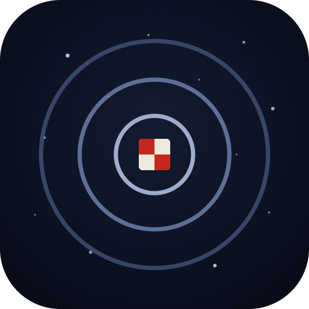

# Universe Atlas

**The universe in your browser, to true scale** — one continuous scroll across
**43 orders of magnitude**, from quark to cosmos: the observable universe
(~10²⁷ m) down through a picnic blanket on the Chicago lakefront and into a
proton (10⁻¹⁶ m). Pure WebGPU, zero runtime dependencies, ~46 KB gzipped.

**Live at [universeatlas.org](https://universeatlas.org/)** — needs a WebGPU
browser (Chrome, Edge, or Safari 18+).

[](https://github.com/chrisjz/universe/actions/workflows/ci.yml)
[](LICENSE)

https://github.com/user-attachments/assets/db0eea40-6617-40e0-815d-882b9786ad90


_The grand tour, 43 orders of magnitude in one continuous flight — press **T** in
the [live atlas](https://universeatlas.org/?tour=1) to fly it yourself._

## The zoom

Forty-three orders of magnitude, and every step of it is the same scene — no
level loads, no cuts. Scroll in and the engine hands focus down the chain
automatically (universe → galaxy → solar system → Earth → the picnic → the
weave → a cotton fiber → a cellulose molecule → a carbon atom → its nucleus →
a proton); scroll out and it hands it back. Or press **T** and let the grand
tour fly you the way. The inward half is _Powers of Ten_'s second act: sizes
are true, arrangements are illustrative — below the atom, nature stops posing
for portraits.

|                                                                                   |                                                                                 |
| :-------------------------------------------------------------------------------: | :-----------------------------------------------------------------------------: |
|  **10²⁷ m** · the cosmic web |       **10²² m** · the Milky Way       |
|     **10¹³ m** · the solar system     |             **10¹⁰ m** · the Sun            |
|               **10⁸ m** · Earth               |  **10¹ m** · the picnic, exactly 1 m |
|       **10⁻¹⁰ m** · a carbon atom      |   **10⁻¹⁴ m** · three quarks   |

## What's real

Structure is real wherever a catalog reaches, and every dimension that can be
real already is:

- **The sky** — **6.8 million stars** at their measured 3D positions: 854k
  ATHYG brights plus a Gaia DR3 faint extension, streamed as hierarchical
  LOD tiles from [a companion data repo](https://github.com/chrisjz/universe-data)
  at `data.universeatlas.org`. Colors from measured color indices, brightness
  from apparent magnitude, 16 bytes per star. The sky is oriented truly:
  Polaris stands over Earth's axis (altitude 41.9°, due north from the
  picnic, like any Chicago scout could tell you), the summer Milky Way climbs
  out of Sagittarius where it should, and the 88 IAU constellations (**C**)
  draw over it — verified against textbook astronomy to under a degree.
- **The local universe** — out to ~260 Mpc, 43,000 galaxies of the 2MASS
  Redshift Survey with Virgo, Coma, and the Great Wall at their measured
  places (the empty band along the Milky Way's plane is the survey's genuine
  zone of avoidance — dust, not absence). Only beyond the surveys' reach
  does procedural placeholder (deterministic seed) take over.
- **Earth** — NASA Blue Marble by day, Black Marble city lights at night,
  Esri World Imagery down to ~2 m/px at street level, real terrain from the
  AWS Terrain Tiles DEM — and you can roam it all (**⇧-drag**), the imagery
  and terrain re-planting themselves wherever you go. The bottom of the zoom
  is an homage: a one-meter red-checkered **picnic blanket on the Chicago
  lakefront** (41.869°N, 87.618°W), where the Eames' _Powers of Ten_ opened
  in 1977.
- **The Moon** — the LROC WAC globe with true synchronous rotation (the real
  ±7.9° optical libration falls out of the uniform spin), LOLA terrain, and
  **Tranquility Base** — the Apollo 11 site — as a second walkable surface.
- **Time** — planets and the Moon sit at their true positions for the
  simulated date and move as the clock runs, from real time to ±1 Gyr/s. The
  Earth turns at the sidereal rate, phase-locked to UTC: the picnic sees
  sunrise when Chicago does, seasons included. The Moon flies its true
  inclined, perturbed orbit, so **every 2026 eclipse lands within ~10
  minutes of its real time** — stand in Reykjavík for the August total
  eclipse, or watch the Moon redden in Earth's umbra. Push past ten years
  per second and the clock goes cosmic: axial precession (scrub +12,000
  years and **Vega** is the pole star), the sun's 225-million-year galactic
  lap, and the cosmic web expanding with the real ΛCDM scale factor.
- **Honesty about the rest** — every focus shows its provenance in the HUD,
  and pressing **X** opens the seam: measured data keeps its natural colors,
  real-size-but-stylized turns amber, purely illustrative turns
  blueprint-cyan. Stand at the picnic and toggle it: the ground you stand on
  is imagined; the sky above you is real.

## Controls

| Input       | Action                                                                                                                |
| ----------- | --------------------------------------------------------------------------------------------------------------------- |
| **scroll**  | seamless zoom — all the way down, all the way back up                                                                 |
| **click**   | focus what's under the cursor (planet, moon, any named star) — camera stays put, scrolling now converges there        |
| **2×click** | fly to what's under the cursor                                                                                        |
| **drag**    | orbit the current focus — on the ground the drag keeps going past the horizon, tilting your gaze up to the night sky  |
| **⇧-drag**  | (or right-drag) grab the ground and roam anywhere on Earth — imagery and terrain follow                               |
| **1–9, 0**  | fly to a bookmark (universe, web, galaxy, system, sun, earth, moon, tranquility base, picnic, weave)                  |
| **/**       | search everything — all 195 named stars, planets, and every stage of the dive                                         |
| **X**       | the honest seam — recolor by provenance: natural = measured, amber = real size but stylized look, cyan = illustrative |
| **C**       | constellations — the 88 IAU figures and their names over the true sky (`?constellations=1`)                           |
| **[ ]**     | time is a signed throttle: **]** toward +1 Gyr/s, **[** through real time into reverse, down to −1 Gyr/s              |
| **P**       | pause the simulation clock                                                                                            |
| **T**       | grand tour: an automated flight through all 43 orders, cosmic web to quarks                                           |
| **Esc**     | cancel the current flight                                                                                             |

On touch screens: drag orbits, **pinch zooms**, **two-finger drag roams
across the planet**, tap focuses, **double-tap flies**, and the search /
time / tour controls are on-screen buttons.

## Every place is a URL

Deep links compose into a 10²⁷-meter, 13.8-billion-year address space:

| Parameter            | Example                                                                                                                                                                                                              |
| -------------------- | -------------------------------------------------------------------------------------------------------------------------------------------------------------------------------------------------------------------- |
| `?goto=`             | [`?goto=jupiter`](https://universeatlas.org/?goto=jupiter) · [`?goto=sirius`](https://universeatlas.org/?goto=sirius) · [`?goto=tranquility`](https://universeatlas.org/?goto=tranquility) — any destination by slug |
| `?lat=&lon=`         | [Paris street level](https://universeatlas.org/?lat=48.8584&lon=2.2945&dist=4000) — anywhere on Earth                                                                                                                |
| `?at=`               | a real moment — [the blood moon of Mar 3 2026](https://universeatlas.org/?goto=moon&at=2026-03-03T11:38:00Z)                                                                                                         |
| `?years=`            | deep time — [just after the Big Bang](https://universeatlas.org/?goto=universe&years=-13e9)                                                                                                                          |
| `?yaw=&pitch=&dist=` | aim and frame the camera                                                                                                                                                                                             |
| `?tour=1`            | start the grand tour on load                                                                                                                                                                                         |

Compose them and you can stand in an eclipse:
[Reykjavík, Aug 12 2026, 17:45 UTC](https://universeatlas.org/?lat=64.147&lon=-21.94&at=2026-08-12T17:45:00Z&dist=25&yaw=71.8&pitch=2)
faces the crescent sun at the moment of totality's approach.

## How it works

Single-precision floats can't hold the universe — the engine composes
hierarchical double-precision reference frames, camera-relative rendering,
and a log-compressed render space (angular sizes and depth ordering
preserved exactly) to fit 43 orders of magnitude into one WebGPU pipeline.
Turning worlds are in-place-mutated orientation registries; the deep sky is
frustum-culled LOD tiles; street level is gnomonic imagery rings displaced
by real DEMs.

**The full deep dive lives in [docs/ARCHITECTURE.md](docs/ARCHITECTURE.md).**

```
src/
  frames.ts    hierarchical double-precision reference frames (the scale engine)
  ephemeris.ts the Moon for real: truncated Meeus series, eclipses on their dates
  math.ts      double-precision vectors, f32 matrices, deterministic PRNG
  scene.ts     the universe: real dimensions, catalogs + procedural structure
  sky.ts       true sky orientation: equatorial/galactic -> scene rotations
  stars.ts     star tile streaming: LOD bands, bounding cones, intensity model
  galaxies.ts  the real local universe: 43k 2MASS Redshift Survey galaxies
  cosmo.ts     cosmic time: the ΛCDM scale factor
  terrain.ts   street-level Earth & Moon: imagery + terrain, stitched at runtime
  shaders.ts   WGSL: lit meshes, additive point sprites, orbit lines
  renderer.ts  thin WebGPU renderer (4 pipelines, 4x MSAA, log depth)
  hud.ts       live scale readout (m → km → AU → ly → Gly) and target buttons
  main.ts      camera, flights, seamless-zoom retargeting, frame loop
```

## Roadmap

The founding roadmap — scale engine to Gaia DR3 — is complete
(<a href="#shipped">shipped ↓</a>). What the atlas would benefit from next,
by theme:

**More real worlds**

- [ ] Mars, the third surface site: Moon Trek's sibling serves CTX imagery and MOLA terrain — land at Jezero crater beside Perseverance
- [x] Real planet faces: NASA global mosaics for Mercury, Mars, and Jupiter on spinning, correctly tilted globes (Venus and the ice giants stay honestly stylized — their visible faces are featureless)
- [x] Saturn's rings at true scale: Cassini's radial scan on the real radii — the Cassini division, and the ring plane riding the real pole (nearly edge-on in 2026, as in the real sky)
- [ ] The Galilean moons: real mosaics, and orbits fast enough to watch — Io laps Jupiter in 42 hours of clock time

**A deeper sky**

- [ ] Stars that move: Gaia proper motions in the tiles — scrub ±100,000 years and watch the Big Dipper come apart
- [ ] Exoplanets: the NASA Exoplanet Archive placed at its real host stars — fly to Proxima b, orbit TRAPPIST-1's seven worlds
- [ ] Messier destinations: the deep-sky catalog at real positions and sizes — M31, M13, the Orion Nebula, searchable and flyable
- [ ] Beyond 260 Mpc: SDSS spectroscopic galaxies as LOD tiles from the data repo — the cosmic web measured, not imagined

**A living solar system**

- [ ] Small bodies from the Minor Planet Center: the real asteroid belt and Kuiper belt as sampled populations, Halley on its true ellipse
- [ ] Low Earth orbit is a place: the ISS and the Starlink shells, propagated from live TLEs

**The experience**

- [ ] The narrated tour: _Powers of Ten_'s beats as captioned stops along the grand tour
- [ ] Named places: IAU gazetteer labels at the right zooms — Tycho and Copernicus on the Moon, Valles Marineris on Mars, cities on Earth
- [ ] Photo mode: hide the HUD, supersample, save
- [ ] The offline atlas: a service worker that keeps visited tiles (PWA)

**Under the hood**

- [ ] Visual regression CI: the headless WebGPU screenshot rig, promoted to a test suite
- [ ] Ephemeris tests against JPL Horizons
- [ ] Mobile performance tier: device-aware star budget and texture sizes

<details id="shipped">
<summary><b>Shipped</b> — the founding roadmap, complete</summary>

- [x] Scale engine: 10²⁷ m → 1 m in one seamless scene
- [x] Scroll-zoom auto-retargeting (zoom _toward what's next_, hands-free)
- [x] Real stars: the 300 brightest (HYG catalog), with five named star destinations
- [x] Click-to-focus: planets, moons, and every named star are clickable destinations
- [x] Deep star catalog: 854k real stars (ATHYG: Tycho-2 + Gaia DR3), streamed as binary tiles
- [x] Gaia DR3 milestone: 6.8M stars via hierarchical LOD tiles (magnitude bands × spatial tiles), streamed from a separate data repo
- [x] Real deep-sky structure: 43k 2MASS Redshift Survey galaxies — Virgo, Coma, the Great Wall — out to ~260 Mpc
- [x] Time: real orbital motion (mean-longitude ephemeris, adjustable clock, `?speed=`)
- [x] Real Earth: NASA Blue/Black Marble globe + the _Powers of Ten_ picnic site in Chicago
- [x] The inward journey: 1 m → 10⁻¹⁶ m, through the blanket to the quarks
- [x] Earth rotation: real diurnal spin — the picnic keeps true Chicago local time
- [x] Axial tilt (23.44°) and seasons: real solstice sun, real day lengths
- [x] True ecliptic–galactic sky orientation: Polaris over the pole, the Milky Way where it really is
- [x] Street-level Earth: Esri World Imagery rings, down to ~2 m/px over the picnic
- [x] Terrain elevation: real DEM heights on the imagery rings (AWS Terrain Tiles)
- [x] Cosmic time scrubbing: 1 Gyr/s clock, axial precession, the galactic year, ΛCDM expansion
- [x] The honest seam: press **X** to see what is measured and what is imagined
- [x] Free Earth navigation: pan anywhere on the planet — street-level imagery and terrain follow (`?lat=&lon=`)
- [x] Reverse time: the clock runs backwards too — rewind and watch the web draw together toward the Big Bang
- [x] Real eclipses: the Moon's inclined, perturbed orbit puts every 2026 eclipse within ~10 minutes of its true time — crescent sun from Reykjavík, blood moon in Earth's umbra
- [x] Constellations: the 88 IAU figures and names over the true sky — press **C** at the blanket and Scorpius stands over the July Milky Way
- [x] Real Moon surface: the LROC WAC globe with true synchronous rotation (libration included), LOLA terrain, and Tranquility Base — the Apollo 11 site — as a second surface site

</details>

## Development

```
npm install
npm run dev       # local atlas at the printed URL
npm run lint      # eslint (typed rules)
npm run format    # prettier --write
npm run build     # tsc --noEmit && vite build
```

Pre-commit hooks (husky + lint-staged) run ESLint and Prettier on staged
files; CI runs lint, format check, typecheck, and build on every PR, and
deploys `main` to [universeatlas.org](https://universeatlas.org/). Star
tiles deploy separately from
[chrisjz/universe-data](https://github.com/chrisjz/universe-data). The data
pipelines (all regenerable from public sources) are documented in
[docs/ARCHITECTURE.md](docs/ARCHITECTURE.md#data-pipelines).

## Data & credits

- **Stars** — [HYG and ATHYG](https://github.com/astronexus) by astronexus
  (CC BY-SA 4.0), and **Gaia DR3**: this work has made use of data from the
  European Space Agency (ESA) mission [Gaia](https://www.cosmos.esa.int/gaia),
  processed by the Gaia Data Processing and Analysis Consortium (credit:
  **ESA/Gaia/DPAC**).
- **Galaxies** — the [2MASS Redshift Survey](http://tdc-www.harvard.edu/2mrs/)
  (Huchra et al. 2012, ApJS 199, 26).
- **Constellations** — [d3-celestial](https://github.com/ofrohn/d3-celestial)
  by Olaf Frohn (BSD-3-Clause).
- **Earth** — NASA [Blue Marble](https://visibleearth.nasa.gov/collection/1484/blue-marble)
  and [Black Marble](https://earthobservatory.nasa.gov/features/NightLights)
  (public domain); street-level imagery © **Esri** — Source: Esri, Maxar,
  Earthstar Geographics, and the GIS User Community, used with attribution
  per Esri's terms; elevation from the
  [Terrain Tiles](https://registry.opendata.aws/terrain-tiles/) open dataset
  on AWS (Mapzen terrarium encoding; SRTM, GMTED2010, ETOPO1 et al.).
- **The Moon** — LROC WAC color and LOLA elevation via NASA SVS's
  [CGI Moon Kit](https://svs.gsfc.nasa.gov/4720) (NASA / GSFC / Arizona State
  University); street-level WAC imagery from
  [NASA Moon Trek](https://trek.nasa.gov/moon/).
- **The planets** — Mars (Viking MDIM 2.1 color mosaic) and Mercury
  (MESSENGER MDIS basemap) via [NASA Trek](https://trek.nasa.gov/); Jupiter
  from Cassini's Dec 2000 global map (PIA07782); Saturn's rings from
  Cassini's natural-color radial scan (PIA08389) — all NASA/JPL, public
  domain.

## License

[MIT](LICENSE) © Chris Zaharia
